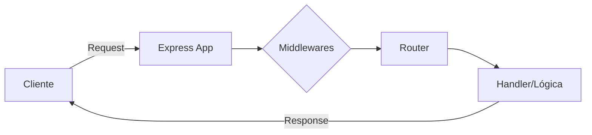

# Manual de Estudio Profundo: Evaluación 1
## Materia: Programación II (Trayecto II)
### Eje Temático: Arquitectura Cliente-Servidor con Express.js
#### Unidades Curriculares: Unidad 7 y Unidad 10

---

## 🧭 Introducción: De Entidades Locales a Sistemas Distribuidos

En el trimestre anterior (**II-IV**), dominamos la **Programación Orientada a Objetos (POO)**, aprendiendo a modelar el mundo real mediante clases, atributos y métodos que viven en la memoria local de nuestra computadora. Logramos que nuestro código fuera ordenado y escalable, pero aún seguía siendo un software "aislado".

En este nuevo trimestre (**II-V**), daremos el salto hacia la **Ingeniería de Software Distribuida**. El código ya no solo gestionará objetos en tu PC; ahora aprenderemos a comunicar esos objetos a través de una red mundial. Pasaremos de crear simples scripts a construir **Servidores de Aplicaciones** capaces de servir a miles de usuarios simultáneamente. Aquí es donde la lógica que aprendiste (Backend) se separa de la interfaz (Frontend), dando vida a la **Arquitectura Cliente-Servidor**.


---

## 🏛️ CAPÍTULO I: La Arquitectura de 3 Capas

La ingeniería de software moderna separa las responsabilidades de una aplicación en capas lógicas para que el sistema sea escalable y seguro.

1. **Capa de Presentación (Frontend / Cliente):** Lo que ve el usuario (HTML, CSS, JS del DOM). Se ejecuta en el navegador (Chrome, Safari). Su única responsabilidad es mostrar la interfaz y capturar las acciones del usuario.
2. **Capa de Negocio (Backend / Servidor):** El cerebro de la operación. Aquí vivirá nuestro servidor Node.js. Recibe peticiones del cliente, aplica reglas lógicas (ej: "verificar si tiene saldo"), y envía respuestas.
3. **Capa de Datos (Base de Datos):** El disco duro de la operación (MySQL/PostgreSQL). Donde la información se guarda de forma permanente.

### El Protocolo HTTP (El Idioma de la Web)
El Cliente y el Servidor hablan un idioma estricto: **HTTP**. 
- El Cliente hace un **Request (Petición)**. Ej: "Oye servidor, envíame la página de inicio".
- El Servidor responde con un **Response (Respuesta)**. Ej: "Claro, aquí tienes el HTML, código de estado 200 (OK)".

---


## 🧩 CAPÍTULO II: El Framework Express.js

### 2.1 ¿Qué es Express.js? (El estándar de la industria)

**¿Qué es?**
Express es un **framework web minimalista y flexible** para Node.js. En el mundo de la ingeniería, se le conoce como un framework "unopinionated" (sin opiniones), lo que significa que no te obliga a seguir una estructura de carpetas estricta, dándote libertad total para diseñar la arquitectura de tu servidor. Es, esencialmente, la capa de software que se asienta sobre las capacidades básicas de Node.js para convertirlo en un servidor web profesional.

**¿Por qué usarlo?**
Escribir un servidor usando solo el módulo `http` nativo de Node.js requeriría cientos de líneas para tareas simples como leer el cuerpo de un formulario o gestionar cookies. Express.js resuelve esto mediante:
1.  **Abstracción de la complejidad:** Convierte peticiones crudas de red en objetos fáciles de usar (`req` y `res`).
2.  **Sistema de Middlewares:** Permite insertar piezas de código (como validadores de seguridad o loggers) que se ejecutan automáticamente entre la petición y la respuesta.
3.  **Rendimiento:** Al ser una capa tan delgada, la velocidad de respuesta es casi idéntica a usar Node.js puro, pero con un código mucho más limpio y mantenible.


### 2.2 El Ciclo de Vida de una Petición (Request Lifecycle)

Para entender cómo programar en Express, debemos visualizar el camino que recorre un dato desde que el usuario hace "clic" hasta que recibe una respuesta. Este es el flujo técnico:

1.  **Petición Entrante (Incoming Request):** El navegador del cliente envía un paquete de datos vía HTTP al puerto de nuestro servidor (ej. puerto 3000).
2.  **Creación de los Objetos `req` y `res`:** Node.js recibe los bits de red y Express los envuelve en dos objetos de JavaScript fáciles de manipular.
3.  **El Túnel de Middlewares:** La petición entra en una "tubería". Antes de llegar a su destino, puede pasar por funciones intermedias que verifican si el usuario está logueado, si el envío tiene virus, o simplemente registran la hora de llegada (Logging).
4.  **Enrutamiento (Matching):** Express compara la URL solicitada con las rutas que tú escribiste. Si hay coincidencia, "dispara" la función correspondiente.
5.  **Lógica de Negocio (Handler):** Tu código se ejecuta. Aquí es donde consultas la base de datos o haces cálculos.
6.  **Respuesta (Outgoing Response):** Invocas un método de respuesta (como `res.send()`). En este momento, Express cierra el ciclo, envía los datos al cliente y libera la memoria.

> **💡 Regla de Oro:** Si una petición entra al servidor y tú no invocas un método de respuesta (`res`) o no la pasas al siguiente middleware (`next`), el navegador del cliente se quedará "colgado" cargando infinitamente hasta dar un error de tiempo de espera (Timeout).




---

## 🏗️ CAPÍTULO III: El Concepto de Enrutamiento (Routing) y Middlewares

### 3.1 Rutas (Endpoints)
Un servidor no hace solo una cosa. Tiene "puertas" lógicas llamadas rutas.
Si el usuario va a `www.miapp.com/usuarios`, el servidor ejecuta una función. Si va a `www.miapp.com/productos`, ejecuta otra.
Express nos permite definir estas rutas fácilmente usando los "Verbos HTTP":
- `GET`: Para *pedir* información (leer).
- `POST`: Para *enviar* información nueva (crear).

### 3.2 Middlewares (Los Guardias de Seguridad)
Un middleware es una función que se ejecuta *en el medio* de una petición. Antes de que tu ruta principal procese la petición, el middleware puede revisarla.
Por ejemplo, un middleware de autenticación: verifica si el usuario está logueado. Si no lo está, bloquea la petición antes de que llegue a la ruta de "Ver Perfil".

### 3.3 Servir Archivos Estáticos (Static Files)
En la arquitectura clásica web, el Backend es el responsable de entregarle al navegador web los archivos base del Frontend (HTML, CSS, imágenes y scripts del DOM). A esta acción se le llama "Servir contenido estático".
Express simplifica enormemente esto usando un middleware nativo llamado `express.static()`. Al indicarle a Express una carpeta física (por ejemplo, `public/`), automáticamente expone todos los archivos de esa carpeta para que el navegador los descargue sin necesidad de programar una ruta manualmente para cada imagen o archivo HTML.

### 3.4 Renderizado de HTML en el Servidor (SSR)
Además de enviar HTML estático puro, Express tiene la capacidad de **Construir HTML Dinámicamente** en el servidor antes de enviarlo al cliente. A este patrón arquitectónico se le conoce como *Server-Side Rendering (SSR)*.
En lugar de enviar un HTML vacío y hacer que el navegador tenga que pedir los datos después con JavaScript, el Backend (Node.js) procesa los datos, los "inyecta" directamente dentro de una plantilla HTML y le envía al navegador la página web ya ensamblada y lista para ser mostrada al usuario. Esto se logra acoplando Express con "Motores de Plantillas" (Template Engines) como **EJS**, **Pug** o enviando HTML puro ensamblado mediante el método `res.sendFile()`.

---

## 💻 Laboratorio: Tu Primer Servidor Web en 10 Líneas

Veamos cómo crear un servidor profesional básico.
*Nota: Debes haber instalado Node.js y ejecutado `npm init -y`, `npm install express` y `npm install ejs` en tu terminal.*

> 
```javascript
// 1. Importar el framework Express
const express = require('express');

// 2. Instanciar la aplicación (Crear el servidor)
const app = express();

// 3. Configurar Middleware para servir archivos estáticos (Fase 1 de la arquitectura)
// Esto le dice al servidor: "Si alguien pide un archivo HTML o CSS, búscalo en la carpeta 'public'"
app.use(express.static('public'));

// 4. Crear una Ruta Básica (Método GET)
app.get('/saludo', (req, res) => {
    // req (Request): Trae la información de quién pide esto.
    // res (Response): Herramienta para responder.
    res.send("¡Hola desde el Backend! Tu servidor está vivo.");
});

// 5. Ejemplo de SSR Profesional usando un Motor de Plantillas (EJS)
// Pre-configuración necesaria: activar el motor de plantillas
app.set('view engine', 'ejs'); // ← OBLIGATORIO: sin esto, res.render() fallará
app.get('/perfil', (req, res) => {
    // Simulamos un dato que nació en el servidor (ej. de una Base de Datos)
    const nombreUsuario = "Estudiante de Ingeniería";
    const horaServidor = new Date().toLocaleTimeString();

    // res.render busca automáticamente el archivo 'perfil.ejs' en la carpeta '/views'
    // Inyecta el objeto de variables en la plantilla, lo compila a HTML y lo envía al navegador
    res.render('perfil', { 
        nombre: nombreUsuario, 
        hora: horaServidor 
    });
});
    // 6. Encender el servidor y ponerlo a escuchar en un puerto de red
    const PUERTO = 3000;
    app.listen(PUERTO, () => {
        console.log(`Servidor de la UPTT corriendo en http://localhost:${PUERTO}`);
    });

```

*(Para que el código anterior funcione, debes crear un archivo llamado `perfil.ejs` dentro de una carpeta llamada `views` en la raíz de tu proyecto, con este contenido:)*

```html
<!-- Archivo: views/perfil.ejs -->
<!DOCTYPE html>
<html lang="es">
<head><title>Perfil SSR</title></head>
<body>
    <h1>¡Hola Mundo!</h1>
    <h2>Bienvenido, <strong><%= nombre %></strong></h2>
    <p>Este HTML fue renderizado en el servidor. La hora es: <%= hora %></p>
</body>
</html>


```

---

## 🖼️ CAPÍTULO IV: Motores de Plantillas (Template Engines)

Un **Motor de Plantillas** es una librería que permite combinar una plantilla HTML con datos dinámicos provenientes del servidor para generar una página HTML final. Express es compatible con cualquier motor que siga el estándar de Node.js.

### 4.1 Configuración en Express

Todos los motores se activan con dos líneas clave antes de definir las rutas:

```javascript
// Indicar qué motor usar
app.set('view engine', 'ejs');

// Opcional: cambiar la carpeta de plantillas (por defecto es ./views)
app.set('views', './vistas');
```

> ⚠️ **Error común:** Si omites `app.set('view engine', 'ejs')`, Express lanzará el error `No default engine was specified` al llamar a `res.render()`.

---

### 4.2 EJS — Embedded JavaScript Templates

Es la opción más popular para quienes vienen de HTML. La sintaxis es HTML puro con etiquetas especiales incrustadas.

**Instalación:** `npm install ejs`

**Etiquetas principales:**

| Etiqueta | Función |
|---|---|
| `<%= valor %>` | Imprime el valor (escapa HTML por seguridad) |
| `<%- valor %>` | Imprime HTML sin escapar (⚠️ peligroso con datos del usuario) |
| `<% codigo %>` | Ejecuta JavaScript sin imprimir nada |
| `<%# comentario %>` | Comentario (no aparece en el HTML final) |

**Ejemplo `views/perfil.ejs`:**
```html
<!DOCTYPE html>
<html lang="es">
<head><title>Perfil de <%= nombre %></title></head>
<body>
    <h1>Bienvenido, <%= nombre %></h1>
    <p>Hora del servidor: <%= hora %></p>

    <% if (esAdmin) { %>
        <p>Tienes acceso de administrador.</p>
    <% } %>

    <ul>
        <% materias.forEach(materia => { %>
            <li><%= materia %></li>
        <% }) %>
    </ul>
</body>
</html>
```

**Ruta en `server.js`:**
```javascript
app.set('view engine', 'ejs');

app.get('/perfil', (req, res) => {
    res.render('perfil', {
        nombre: 'Estudiante de Ingeniería',
        hora: new Date().toLocaleTimeString(),
        esAdmin: false,
        materias: ['Programación II', 'Cálculo', 'Base de Datos']
    });
});
```
💡 **Observación — Modo Vigilancia (`--watch`):** En lugar de detener y reiniciar el servidor manualmente cada vez que modificas el código, puedes iniciarlo con el flag `--watch`:
> ```
> node --watch server.js
> ```
> Node.js detectará automáticamente cualquier cambio guardado en los archivos y reiniciará el servidor por ti. Este flag está disponible de forma nativa desde **Node.js v18** sin necesidad de instalar herramientas adicionales como `nodemon`.

---

## 📘 ANEXO: Diccionario Técnico Formal

- **Arquitectura Cliente-Servidor:** Modelo de diseño de software distribuido que separa las cargas de trabajo entre proveedores de recursos (servidores) y demandantes (clientes) sobre una red computacional.
- **Node.js:** Entorno de ejecución de servidor asíncrono y dirigido por eventos basado en el motor V8 de Google, diseñado para construir aplicaciones de red escalables en JavaScript.
- **Express.js:** Framework web transaccional para Node.js que proporciona una infraestructura robusta para aplicaciones web y APIs, simplificando el enrutamiento y manejo de peticiones.
- **HTTP (Hypertext Transfer Protocol):** Protocolo de comunicación de la capa de aplicación sin estado, estándar fundamental para la transferencia de hipertexto en la World Wide Web.
- **Enrutamiento (Routing):** Proceso de definición de los puntos finales de una aplicación (URIs) y cómo responden a las peticiones de los clientes mediante los distintos métodos HTTP.
- **Middleware:** Capa de software subyacente que intercepta peticiones HTTP para ejecutar lógicas intermedias (parseo, autorización, logging) antes de transferir el control al manejador de ruta final.
- **Motor de Plantillas (Template Engine):** Librería que combina una plantilla HTML con datos dinámicos del servidor para producir un documento HTML final, habilitando el patrón SSR.
- **EJS (Embedded JavaScript Templates):** Motor de plantillas que extiende HTML estándar con etiquetas especiales `<%= %>` para incrustar expresiones JavaScript evaluadas en el servidor.
- **SSR (Server-Side Rendering):** Patrón arquitectónico en el que el servidor genera el HTML completo antes de enviarlo al cliente, en contraposición al CSR donde el HTML se construye en el navegador.
